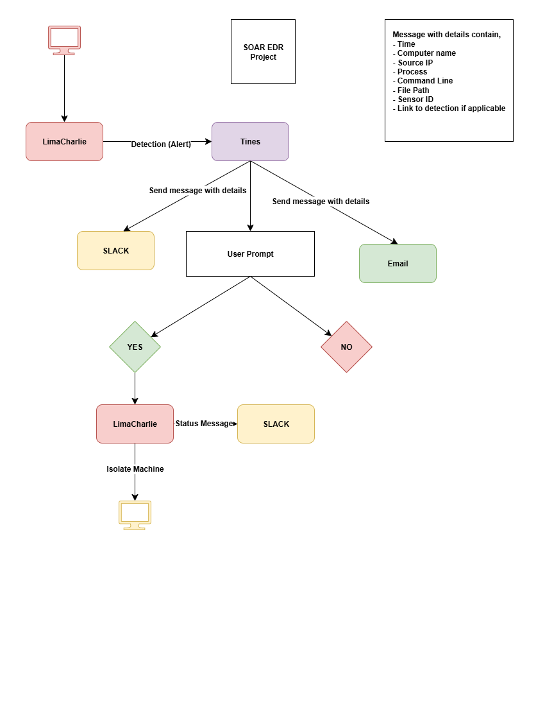

<h1 style="color:blue;"> SOAR EDR Project</h1>

<h3> Resources Used </h3>

 <ul type="circle">
 <li>Tines - Security Ooperations Automation Response Platform</li>
 <li>LimaCharlie - Endpoint Detection Response Platform</li>
 <li>Windows Virtual Machine as an agent</li>
 <li>Slack - Messaging Channel </li>
</ul> 

<h3>Overview</h3>
The lab consists of gaining hands-on experience with the use of SOAR and EDR platforms.

 SOAR implementations are increasingly used by a wide variety of Security Operations Centres (SOC) to reduce repetitive tasks and automate their processes. Security processes are developed as playbooks by professionals in SOAR platforms to enable integration with various tools and systems across the security infrastructure. 

In this lab, a detection rule is implemented in LimaCharlie to identify a hacking tool known as LaZagne, which is used to extract stored passwords from a machine. Upon detection, an alert is sent to Tines, where an automated playbook (story) is triggered. This story alerts the user via email and Slack, notifying them of the potential infiltration. Additionally, it prompts the user to decide whether to isolate the infected machine, and based on the response, the system proceeds to carry out the appropriate action.

<h3>Part 1 - Diagram and Playbook Overview</h3>

For part 1 of the project, the main objective is to create a playbook workflow through a diagram. This is created using a site called <b> draw.io </b>

<h4> Playbook Objective </h4>
<ul type="circle"> 
  <li> Send a Slack message and email containing information about the detection </li>
  <li> Generate user prompt to action necessary precautions </li> </ul>

  

<h4> User Prompt Explanation</h4>

Tines will prompt the user to ask whether to isolate or not infect the machine (YES/NO)
- if YES = LimaCharlie should automatically isolate the machine and a message should be sent to Slack
- Message: Isolation status with note of "The Computer has been isolated"
- If NO = LimaCharlie will not isolate
- Message: Isolation status with note of "The Computer was not isolated, please investigate"

<h3>Part 2 - Setup LimaCharlie and Virtual Machine</h3>

The first step in this part was to create the Windows virtual machine that will act as the infected machine in this scenario. This was done by downloading the Windows 10 ISO image and creating a VM through Oracle VirtualBox.After the setup of the machine, I used the browser in the machine itself to access LimaCharlie. 

In LimaCharlie, I created a new installation key which can be used to connect the machine with LimaCharlie through PowerShell.

<h3> Conclusion </h3>

This project successfully demonstrated how to configure a Security Information and Event Management (SIEM) system using Microsoft Sentinel within Azure. By creating a honeypot VM, disabling security measures, and logging failed login attempts, we were able to collect valuable security data and analyze it using Kusto Query Language (KQL). The integration of Microsoft Sentinel allowed us to visualize attack patterns and understand potential threats targeting the system.

<h3> Reflection </h3>

One of the key takeaways from this project was the importance of proactive monitoring and logging in cybersecurity. It also gave me a glimpse of the workings of real-world SIEM and SOC. This lab served me as a foundational exercise for building more advanced security monitoring solutions.

<h5> Skills obtained </h5>

<ul> 
 <li> Microsoft Azure configurations </li>
 <li> Kusto Qurey Language </li>
 <li> Working with SOC and SIEM setup </li>
</ul>

<h5> References </h5>
https://www.youtube.com/watch?v=g5JL2RIbThM
  https://www.youtube.com/watch?v=RoZeVbbZ0o0&t=1580s
  https://learn.microsoft.com/en-us/azure/azure-monitor/essentials/data-collection-transformations
  https://learn.microsoft.com/en-us/azure/azure-monitor/logs/custom-fields
